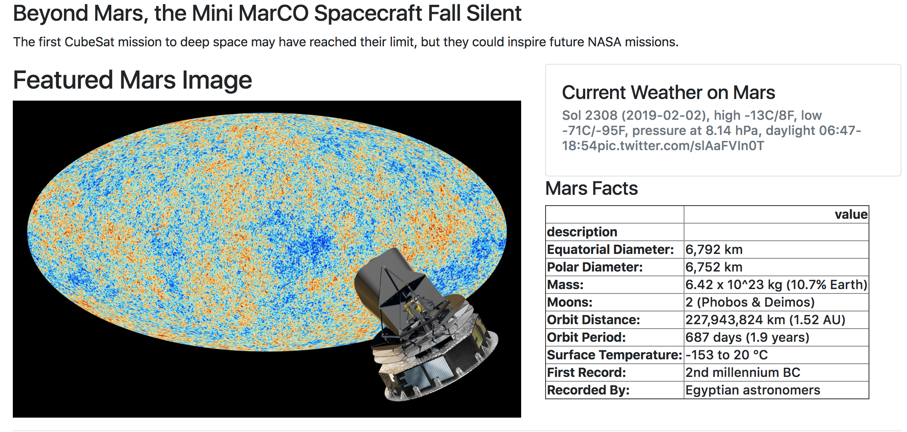
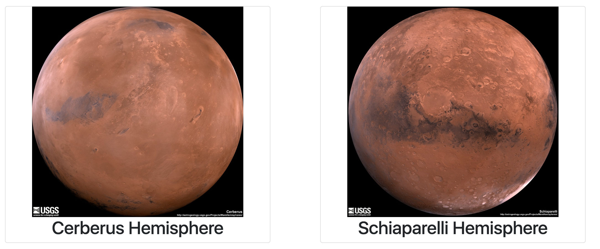

# Mission-To-Mars

Objective of this activity is to build web application that scrapes various websites for data related to the Mission to Mars and displays the information in a single HTML page.

Screen Shot of the page

